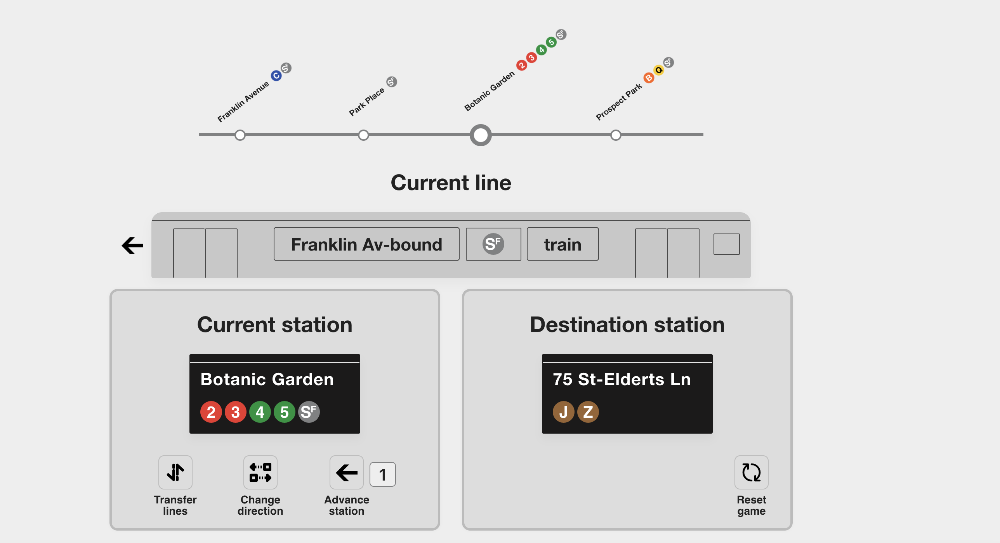
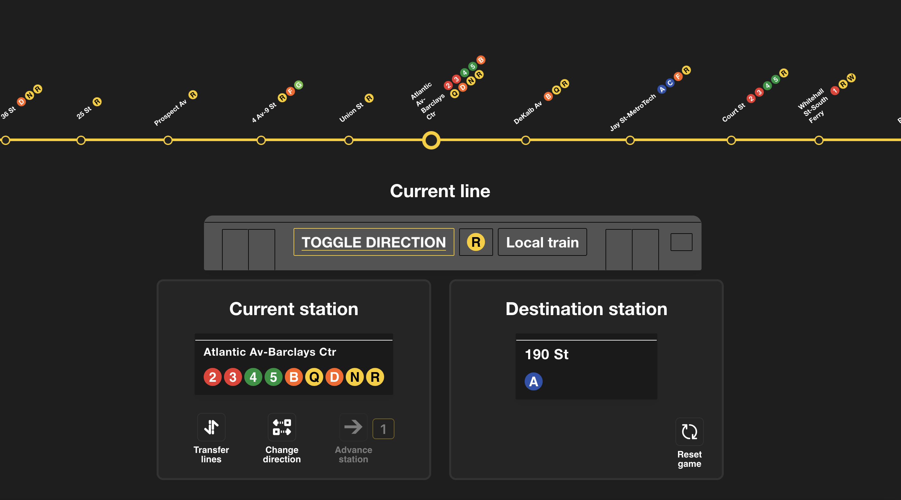
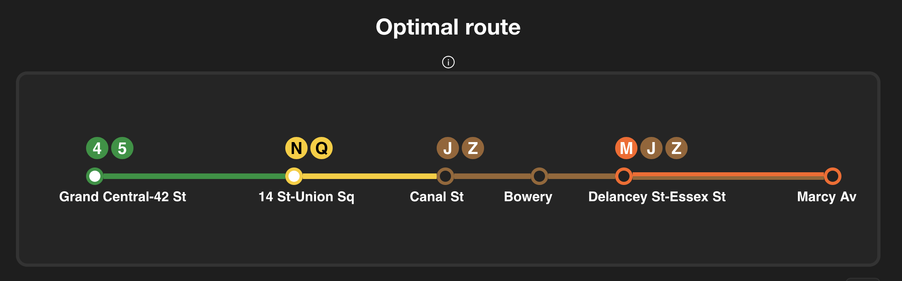
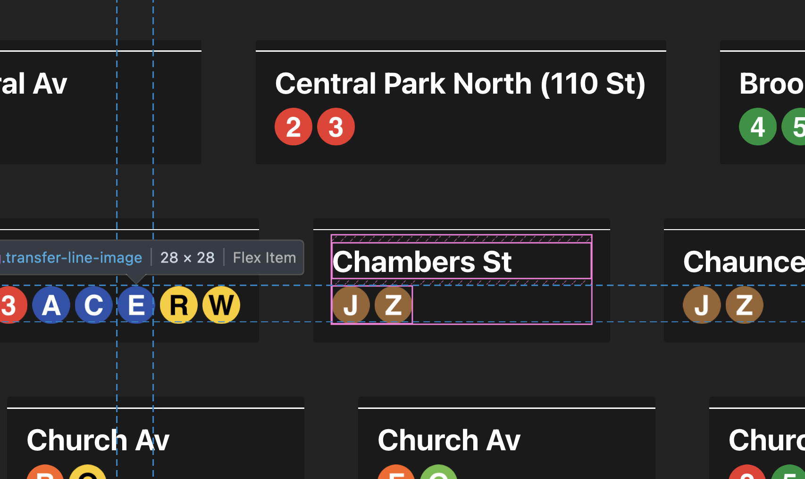

# NYC Subway Journey Game 


|  |  |
| -----------------------------------------------------------| ---------------------------------------------------------- |

- [NYC Subway Journey Game](#nyc-subway-journey-game)
  - [Developer's note](#developers-note)
- [Running the project](#running-the-project)
  - [Play online](#play-online)
  - [Running locally with Docker](#running-locally-with-docker)
  - [Running locally with Node.js](#running-locally-with-nodejs)
- [How to play](#how-to-play)
  - [Initialization](#initialization)
  - [Gameplay](#gameplay)
    - [Configuration settings](#configuration-settings)
    - [Keyboard shortcuts](#keyboard-shortcuts)
- [Game modes](#game-modes)
  - [Rider mode](#rider-mode)
  - [Conductor mode](#conductor-mode)
- [Optimal route](#optimal-route)
- [Station image HTML elements](#station-image-html-elements)

## Developer's note

This is a "from scratch" project. All components, animations, layout, and game logic are custom-built. I intentionally avoided third-party UI libraries or game engines so I could have more control over my project. I have learned so much from building it this way.

Everything from rider movement and staircase mechanics to platform interactions and SVG animations is run by my own TypeScript logic (3,000+ lines) and *extensive* custom CSS (~1,500 lines). I even implemented my own coordinate system for passenger pathfinding and wrote a Python breadth first search backend for an optimal route algorithm. Even tiny details, like button behaviors and icon rendering, are manually programmed.

> See [station image HTML elements](#station-image-html-elements) for more info on how I designed station images for the browser.

# Running the project

## Play [online](https://nolansmug.github.io/)
- Built with Docker in CI/CD and deployed as static files to GitHub Pages.


## Running locally with Docker

> Make sure you have Docker [installed](https://www.docker.com/get-started)

**1. Pull the Docker image**
```bash
docker pull nanosmug/nyc-subway-journey
```
> Image on Docker Hub [here](https://hub.docker.com/r/nanosmug/nyc-subway-journey)


**2. Run the Docker container**
```bash
docker run -p 3000:80 nanosmug/nyc-subway-journey
```

**3. Open the application**
Open your browser and go to [http://localhost:3000](http://localhost:3000)

> Make sure Docker is [installed](https://www.docker.com/get-started) and running.  
> 
> Reach me via [email](mailto:nolangcyr@gmail.com) with any issues.

## Running locally with Node.js
> Make sure you have `Node.js` [installed](https://nodejs.org/en/download) 

**1. Clone the repository**
```bash
git clone https://github.com/NolanSmug/nyc-subway-journey-react
cd nyc-subway-journey-react
```

**2. Install dependencies and run project**
- **Npm**
  > Make sure you have `npm` [installed](https://docs.npmjs.com/downloading-and-installing-node-js-and-npm)  
  ```bash
  npm install
  npm run start
  ```

- **Yarn**
  > Make sure you have `yarn` [installed](https://yarnpkg.com/getting-started/install)
  ```bash
  yarn install
  yarn start
  ```
# How to play
You are placed into a random NYC subway station. Your objective is to reach another randomly given station by utilizing your knowledge of the NYC subway system.

## Initialization
1. **Random starting point:**
   - At the beginning of the game, you are assigned:
     - A **starting station**
     - A **destination station** (see [all_stations.csv](./public/csv/all_stations.csv))
     - A **starting line** (ex:, , , ...)

2. **Choosing a direction:**
   - Before you can move, you must choose a **direction** (e.g. `UPTOWN`, `DOWNTOWN`).
   - **Rider Mode:** Board the train on the side of the platform matching your desired direction.
   - **Conductor Mode:** Select the direction using the `[Toggle direction]` button.
   - The `Advance` button will not be available until a direction is chosen (or a train is boarded).
       > If you want, you may transfer to a different line before selecting a direction.

3. **Ready to move:**
   - Once a direction is established, you are able to `Advance` and `Transfer`. 

## Gameplay

1. **Navigating the subway:**
   - **Rider Mode:** Interact with the environment (doors, stairs) to move your character.
   - **Conductor Mode:** Use the UI buttons to control the train directly.

   **Actions:**
     -  `Advance station`: Advance 1 station (see [conductor mode](#conductor-mode) to control this value).
     -  `Change direction`: Reverses your current direction. Each line has specific uptown and downtown labels.
     -  `Transfer lines`: Click on a subway line at your **current station** to switch to that line and continue your journey (see [rider mode](#rider-mode) for specific transfer mechanics).
        > **Note:** Using this button is optional. You can directly click on a subway line icon at the current station to switch to it as well.
     - `Refresh` – Refreshes the current game with new starting and destination stations.  
<br>

2. **Goal:**
   - Successfully navigate from your starting station to your destination station by advancing through stations and transferring train lines as needed. Be mindful of your `current direction` throughout as well.
  
### Configuration settings
- **`Theme`** – Toggle light/dark mode
- **`Upcoming stations`** – Toggle upcoming stations visibility
- **`Upcoming stations layout`** – Toggle the upcoming stations view between **vertical** or **horizontal**
- **`Conductor mode`** – Enable conductor mode (default is rider mode)

### Keyboard shortcuts
- `→` Advance station
- `t` Transfer lines
- `c` Change direction
- `u` Change direction UPTOWN
- `d` Change direction DOWNTOWN
- `r` Reset game
- `+` Increase advance count*
- `-` Decrease advance count*
- `Esc` Exit transfer
<br><br>
- `Shift` + `D` – Toggle **Theme**
- `Shift` + `U` – Toggle **Upcoming stations**
- `Shift` + `L` – Toggle **Upcoming stations layout***
- `Shift` + `C` – Toggle **Game mode**
<br><br>
  \**conductor mode only*

# Game modes

## Rider mode

Rider mode is the default game mode and is the recommended mode for those who are learning and want to visualize their journey. 


You are riding from the *passenger's perspective*. Watch your character "walk" around the screen as you perform actions. 

* **Boarding:** Click the `board train` button next to the respective train you'd like to board (`UPTOWN` or `DOWNTOWN`).
* **Riding:** Once on board, use the `Advance` button to travel to the next station.
* **Transferring:** 
    1. Click `transfer` to step back onto the platform.
    2. Click on a `staircase` to explore other lines. A tunnel will appear.
    3. Select your new line and watch your rider walk through the tunnel to the new platform.

> *Click on the rider to toggle gender! (male/female/other)*


## Conductor mode
Conductor mode is for players who want to bypass the animations and play at a faster pace, or for those who already understand how to physically navigate the system. It grants you direct control over the train's state.



* There is no longer a passenger to control. You are the train! 
* All actions (`Advance`, `Transfer`, `Change direction`) are executed immediately.
* You can set the number of stations the train advances per click.
* You can toggle the `Upcoming Stations` display to be **vertical** now too!

# Optimal route

Upon winning the game, you can choose to reveal the **Optimal route**. This feature calculates the *mathematically shortest path* (fewest stops) from your starting station to the destination station.



- Calculated using the [Breadth-First Search](https://en.wikipedia.org/wiki/Breadth-first_search) algorithm.
- The graph construction and algorithm are implemented in [bfs.py](./src/logic/bfs.py).
  - **Note:** This contains `FastAPI` endpoints that are being hosted (for free) on [render.com](https://render.com/). The `bfs.py` in this repo is a copy of the code hosted there.

> It can often be difficult to match the optimal route's path. Don't let this frustrate you! I plan on implementing heuristics to make the algorithm's route suggestions more realistic.

<br>

# Station image HTML elements

I wasn't happy with the idea of using static images for each of the 400+ stations, so I built my own dynamic elements using HTML and CSS. It’s a lot faster, looks better, and is how I got the conductor mode transfers to work. If you're interested in how I styled them, the original repo is [here](https://github.com/NolanSmug/mta-subway-stations-html)



<br>

---

This project was bootstrapped with [Create React App](https://github.com/facebook/create-react-app).
