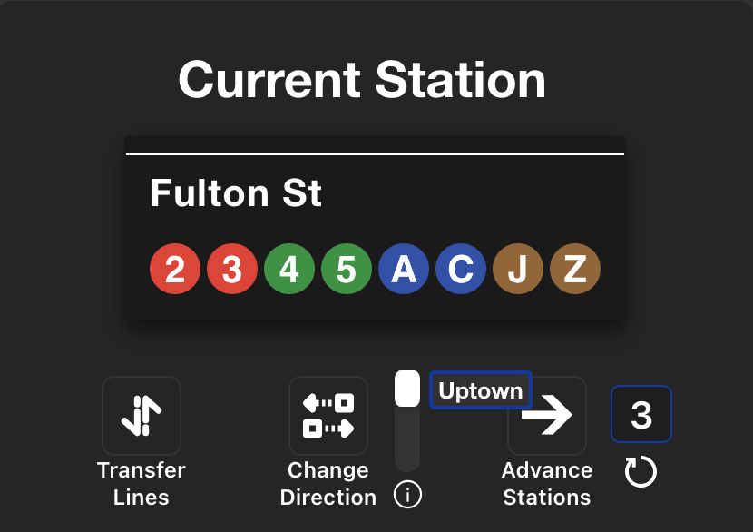

# NYC Subway Journey Game React App


- [NYC Subway Journey Game React App](#nyc-subway-journey-game-react-app)
    - [Screenshots](#screenshots)
  - [Running the Project](#running-the-project)
    - [1. Clone the repository:](#1-clone-the-repository)
    - [2. Build the Docker image:](#2-build-the-docker-image)
    - [3. Run the Docker container:](#3-run-the-docker-container)
    - [4. Open the application:](#4-open-the-application)
  - [How to Play](#how-to-play)
    - [Initialization](#initialization)
    - [Gameplay](#gameplay)
    - [Configuration Settings](#configuration-settings)
    - [Conductor Mode](#conductor-mode)
    - [Keyboard Shortcuts](#keyboard-shortcuts)


### Screenshots
|  |  |
| -----------------------------------------------------------| ---------------------------------------------------------- |

## Running the Project

> Make sure you have Docker [installed](https://www.docker.com/get-started)
### 1. Clone the repository:
  ```bash
  git clone https://github.com/NolanSmug/nyc-subway-journey-react
  cd nyc-subway-journey-react
  ```

### 2. Build the Docker image:
  ```bash
  docker build -t subway-game .
  ```

### 3. Run the Docker container:
  ```bash
  docker run -p 3000:3000 subway-game
  ```

### 4. Open the application:
  Open your browser and go to [http://localhost:3000](http://localhost:3000).

> If the app doesn't load, make sure Docker is [installed](https://www.docker.com/get-started) and running.

## How to Play
You are placed into a random NYC subway station. Your objective is to reach another randomly given station by utilizing your knowledge of the NYC subway system.

### Initialization
1. **Random Starting Point:**
- At the beginning of the game, you are assigned:
  - A `starting station` 
  - A `destination station` (see [all_stations.csv](./public/csv/all_stations.csv))
  - A `starting line` (e.g., A, 2, N,...)
2. **Choosing a Direction:**
- Before you can move, you must choose a `starting direction` (e.g. UPTOWN, DOWNTOWN) by either: 
   - Clicking the `[Toggle Direction]` text on the subway car, or 
   - Clicking `Change Direction` button. 
- The `Advance` button will remain disabled until a direction is chosen.
     > If you want, you may transfer to a different line before selecting a direction.
3. **Ready to Move:**
- Once a direction is selected, you are able to `Advance` and `Transfer`. 

### Gameplay

1. **Navigating the Subway:**
- The game UI displays your `current station` and `destination station`. Like you would in real life, use the according actions to progress:

   **Buttons:**
  -  `Advance Station` – Advance 1 station (see `conductor mode` to control this value)
  -  `Change Direction` – Reverses your current direction. Each line has specific `UPTOWN` and `DOWNTOWN` labels.
  -  `Transfer Lines` –  Click on a subway line at your `current station` to switch to that line and continue your journey in the same direction.
      > **Note:** Using this button is optional. You can directly click on a subway line icon at the current station to switch to it as well.
  - `Refresh` – Refreshes the current game with new starting and destination stations.  
<br>

2. **Goal:**
- Successfully navigate from your starting station to your destination station by advancing through stations and transferring train lines as needed. Be mindful of your `current direction` throughout as well.
  
### Configuration Settings
- **`Theme`** – Toggle light/dark mode
- **`Upcoming Stations`** – Toggle upcoming stations visibility
- **`Upcoming Stations Layout`** – Set the upcoming stations view to vertical or horizontal
- **`Conductor Mode`** – Enable conductor mode (default is rider mode)


### Conductor Mode
Think of conductor mode as a sort of a professional feature mode. When enabled, users are able to:  

1. Advance an input number of stations (with "reset to 1" button)
2. Configure the "default" `starting direction` upon completing a transfer
   - `Uptown`
   - `Select Direction` (user is given choice of direction each time)
   - `Downtown`
3. View all available [keyboard shortcuts](#keyboard-shortcuts)

|  |
| ------------------------------------------------------------- | 

> The 'Uptown' text fades shortly after each toggle click.

### Keyboard Shortcuts
- `→` Advance Station
- `t` Transfer Lines
- `c` Change Direction
- `r` Reset Game
- `+` Increase Advance Count
- `-` Decrease Advance Count
<br><br>
- `Shift` + `D` – Toggle **Theme**
- `Shift` + `U` – Toggle **Upcoming Stations**
- `Shift` + `L` – Toggle **Upcoming Stations Layout**
- `Shift` + `C` – Toggle **Conductor Mode**

<br><br>

This project was bootstrapped with [Create React App](https://github.com/facebook/create-react-app).
