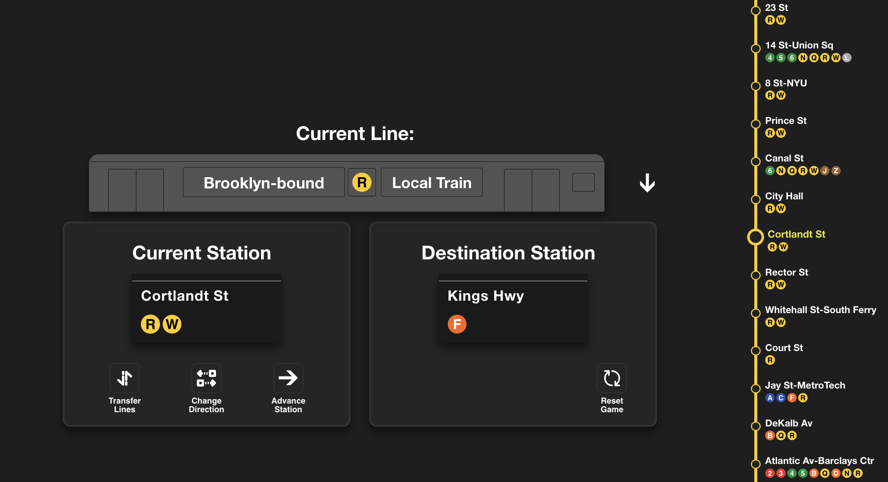
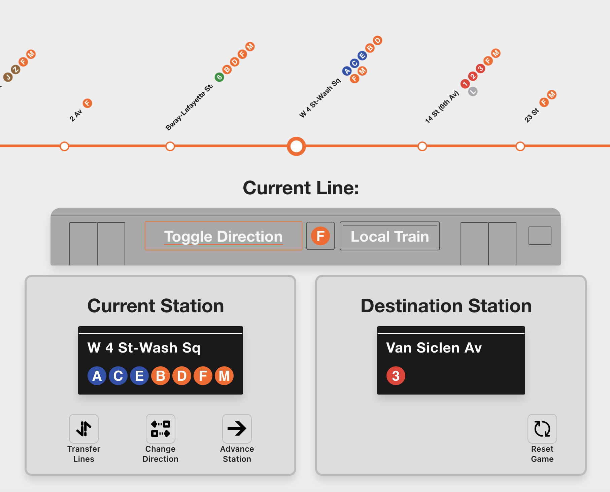

# NYC Subway Journey Game React App

### Screenshots

## How to Play
You are placed into a random NYC subway station. Your objective is to reach another randomly given station by utilizing your knowledge of the NYC subway system. 

1. **Initialization:**
- The user is given a random `starting station`, `destination station` and `starting line` within the subway system. (see [all_stations.csv](./public/csv/all_stations.csv))
- They must select a `starting direction` by either clicking the text on the subway car or the `Change Direction` button. Advancing the train will not work until a direction is chosen.
     > If you want, you may transfer to a different line before selecting a direction.
- You are now able to `Advance` and `Transfer`  
 
2. **Gameplay:**
- The game displays your `current station` and `destination station`.  
 
3. **Buttons:**
-  `Advance Station` – Advance 1 station (see `conductor mode` to control this value)
-  `Change Direction` – Reverses your current direction. Each line has specific `UPTOWN` and `DOWNTOWN` labels.
-  `Transfer` –  Click on a subway line at your `current station` to switch to that line and continue your journey in the same direction.
    > **Note:** Using this button is optional. You can directly click on a subway line at the current station to switch to it as well.
- `Refresh` – Refreshes the current game with new starting and destination stations.

This project was bootstrapped with [Create React App](https://github.com/facebook/create-react-app).